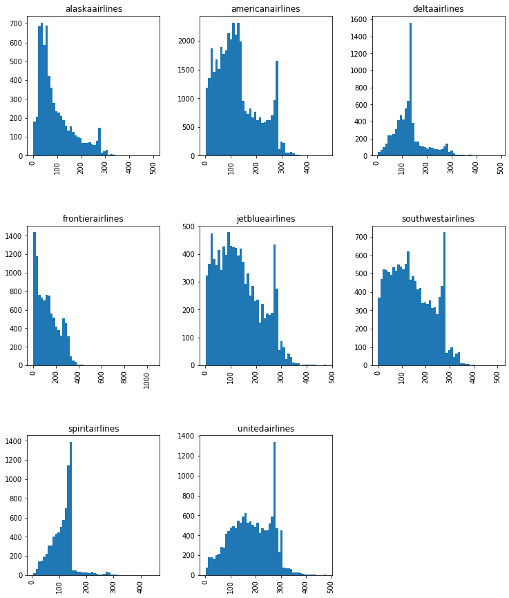

# NLP_finalproject

**Overview:**

An airline has been wanting to improve their reputation with customer and employee experiences.  Since their survey reviews already account for their individual airline they’d like to provide due diligence on the entire industry.

They need help web scraping twitter to perform natural language processing on social media tweets within the last 2-5 years (if each airline has that many tweets).

**Project Presentation:**

https://docs.google.com/presentation/d/1djEjBMIgj4O1GO1v97o0FVsGhJcDT7Eo/edit#slide=id.p1

**Data Evaluation**
The below graph shows the distribution of tweet lengths. Normally the max tweet length is 120 characters. The distribution graph shows differently because it is expanding with pictures and website links. Before we start the vectorization process we want to remove all website and picture links.

View the graph below to view the lengths of tweets between each major airline. 

