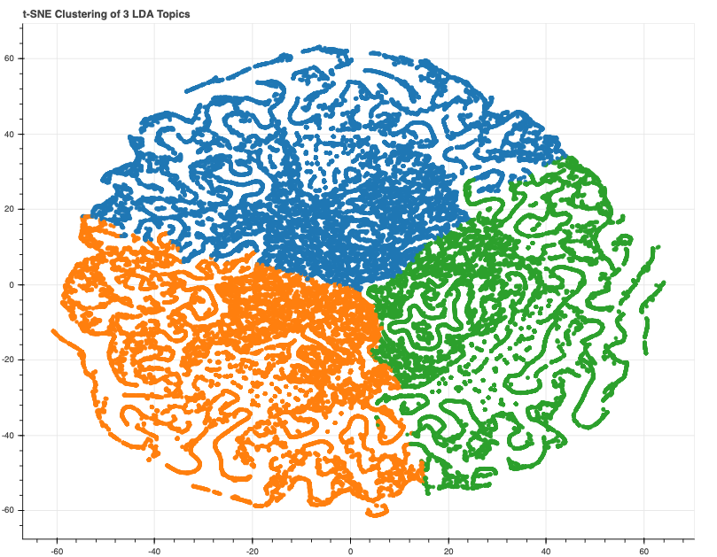
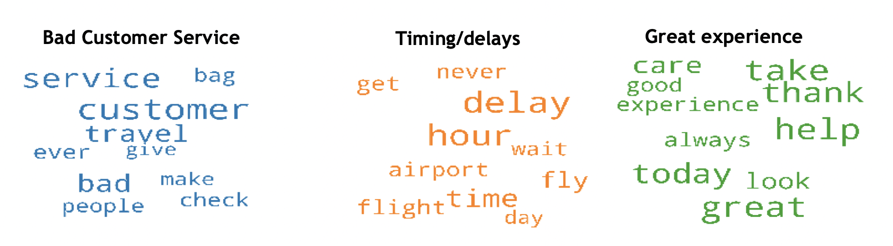
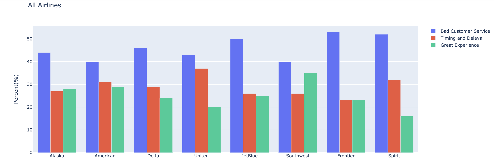

# Airline Twitter Analysis using Natural Language Processing

**Overview:**

An airline has been wanting to improve their reputation with customer and employee experiences.  Since their survey reviews already account for their individual airline they’d like to provide due diligence on the entire industry.

They need help web scraping twitter to perform natural language processing on social media tweets.

**Goals:**
1. Use topic modeling to classify different areas of interest per airline.
2. Use sentiment analysis in order to determine positive and negative tweets.
3. Provide visuals for each airline.

**Data:**

Collect 110,000 tweets using Twint (2018-2019)

4 Major Airlines:
- United Airlines
- American Airlines
- Delta Air Lines
- Alaska Airlines
4 Low-Cost Carrier Airlines
- Southwest Airlines (largest low-cost carrier)
- JetBlue
- Frontier (ultra low)
- Spirit (ultra low)

**Project Presentation:**

https://docs.google.com/presentation/d/13gIP81APp5hRM4ufGbypwsZV07Cl7n-0/edit#slide=id.p1

**t-SNE Cluster Analysis**

Below you can see a Coherence score evaluation. Our highest coherence score is .44 with 3 topics. When running a t-SNE Cluster analysis you can see there is not much overlap between each cluster.
We will also run a LDA Visualization.

**Word Clouds**

You can see the three distinct topics shown in the word clouds. The larger the word the heavier the weight between each word. Meaning that the larger words are used more frequently in the given topic. I've renamed Topic 0, Topic 1, and Topic 2 with the most frequently used words.

**Analysis**

After running our LDA Model, Sentiment Analysis, and Topic Modeling, we need to analyze the tweets of the dominant topics per Airline. Since we scraped a different amount of tweets per airline I took a ratio of dominant topics to compare between all airlines.

You need to take bias into account when analyzing social media tweets. Majority of customer will only tweet if they have negative experiences on an airline. So comparing individual topics per airlines would be your best bet.

Key Results:
1. Of the top 3 Major Airlines (United, American, and Delta), Delta airlines had the worst reputation with "bad customer service".
2. United Airlines ranked highest number of tweets that were about timing and delays
3. The ultra low cost carriers (Spirit and Frontier) lack with customer service.
4. Southwest ranked the most positive with tweets.

See results below!

  
